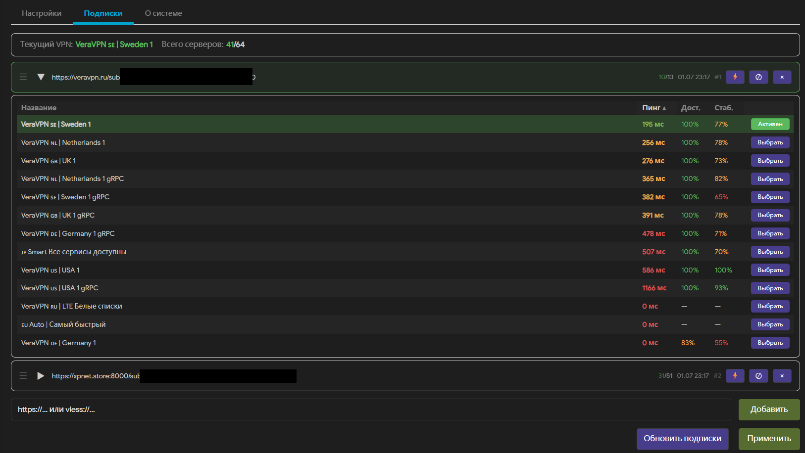

# podkop-smartlink v1.2.0

> Следит за VPN-подписками, проверяет сервера и держит [Podkop](https://github.com/itdoginfo/podkop) на рабочем подключении. При проблемах автоматически выбирает здоровую замену.



## Требования

Установленный Podkop:

```sh
wget -O - https://raw.githubusercontent.com/itdoginfo/podkop/refs/heads/main/install.sh | sh
```

## Установка / Обновление

Стабильная версия:

```sh
wget -O - https://raw.githubusercontent.com/CriDos/podkop-smartlink/refs/heads/main/_install.sh | sh
```

## Удаление

```sh
wget -O - https://raw.githubusercontent.com/CriDos/podkop-smartlink/refs/heads/main/_uninstall.sh | sh
```

Конфиг сохраняется. Полное удаление: `rm -f /etc/config/podkop-smartlink`

## Возможности

- Подписки и прямые ссылки (`vless://`, `ss://`, `trojan://`) в одном списке
- Исключение серверов в каждой подписке по простым вхождениям
- Sticky-выбор — текущий сервер не меняется, пока пинг в норме
- Автопереключение после N проблем подряд на здоровый сервер
- Статистика: доступность и стабильность по каждому серверу
- LuCI-интерфейс с drag-and-drop приоритета, ручным выбором сервера, логом и i18n
- Проверка доступности через VPN-туннель до настраиваемого адреса

## Настройка

LuCI: **Services → Podkop SmartLink**

### Настройки

- **Обновление подписок** — как часто скачивать подписки и обновлять список серверов.
- **Расширенные транспорты** — показывает XHTTP и другие новые типы подключений, если sing-box их поддерживает.
- **Учитывать порядок подписок** — при автозамене выбирать из подписок выше по списку.
- **Мониторинг выбранного сервера** — интервал проверки текущего сервера, максимальный пинг и количество проблем подряд до замены.
- **Stats ping** — фоновый пинг всех серверов для таблицы и статистики. Не влияет на автопереключение.

Временные и числовые параметры в LuCI выбираются из фиксированных списков.

### Подписки

В разделе **Подписки** можно задать фильтр **Исключать сервера** для конкретной подписки.
Формат простой: `Россия; Finland; gRPC; example.com`.

Правила:

- разделитель — точка с запятой;
- пробелы по краям значений игнорируются;
- совпадение ищется в названии сервера, хосте и полной ссылке;
- исключённые серверы видны в SmartLink как отключённые, но не передаются в Podkop.

## CLI

```sh
podkop-smartlink get_status          # состояние (JSON)
podkop-smartlink get_sources         # источники (JSON)
podkop-smartlink ping_all            # пинг всех серверов
podkop-smartlink ping_source <idx>   # пинг одного источника
podkop-smartlink select_proxy <tag>  # ручной выбор сервера
podkop-smartlink refresh_now         # обновить подписки (фон)
podkop-smartlink reset_stats         # сброс статистики
podkop-smartlink get_info            # система (JSON)
podkop-smartlink get_log             # структурированный лог SmartLink (JSON)
podkop-smartlink show_version        # версия
```

## Расширение протоколов (опционально)

sing-box с расширенными протоколами (xhttp и др.):

```sh
sh <(wget -qO- https://raw.githubusercontent.com/EikeiDev/OpenWRT-sing-box-extended/refs/heads/main/install.sh)
```
